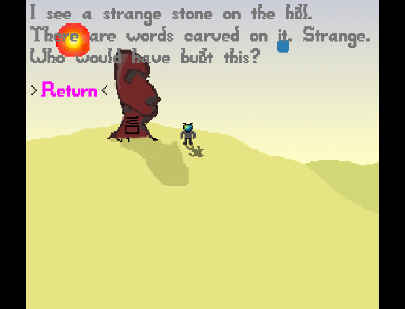

# The Dark Side of the Moon

Author: Yifei Li (yifeili3)

Design: Major Tom happened to land on the Moon, and met a ridiculous prophet who brought him even more mysteries.

Screen Shots:

How To Play:

Use keyboard UP & DOWN to select different choices, and press ENTER to confirm selection.

Art Sources:

Based on base art sources, I draw all other figures.

Memes:

- The Dark Side of the Moon: album of Pink Floyd
- Major Tom: character in David Bowie's song "Space Oddity"
- Aladdin: character of the story with Lamp God
- Sane: actually "Aladdin Sane" is another song of David Bowie
- Write the word: origin is "say the word", from Cube Escape
- FATE: also from Cube Escape
- "Planet Earth is Blue, and there's nothing I can do": lyrics of "Space Oddity"; there are other lyrics in the game
- Bollocks: British style of cursing, since David Bowie (as well as Major Tom) is English.
- Strange stone: Moai on Easter Island, also inspired by the cover of Pink Floyd's album The Division Bell
- Now you see I'm a Rock fan :-)

This game was built with [NEST](NEST.md).
